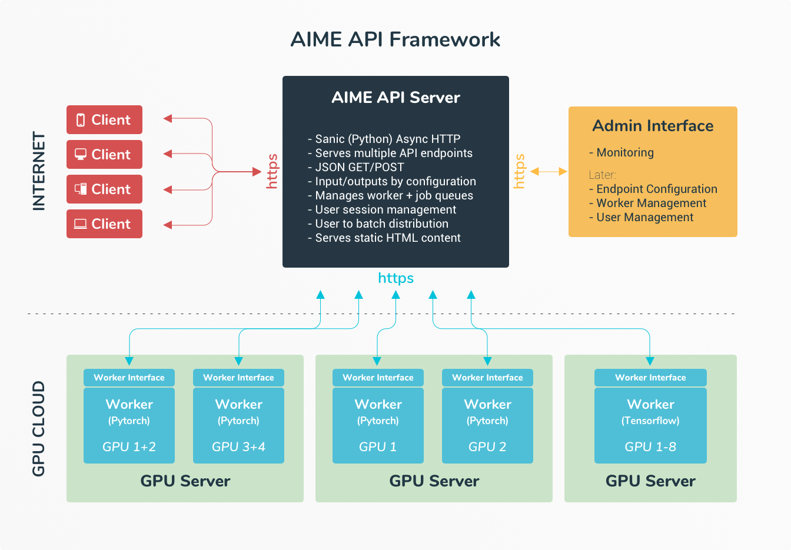

.. Copyright (c) AIME GmbH and affiliates. Find more info at https://www.aime.info/api
   This software may be used and distributed according to the terms of the AIME COMMUNITY LICENSE AGREEMENT

AIME API Server - The Scalable Model Inference API Server
=========================================================

.. toctree::
   :maxdepth: 1
   :hidden:

   
   Setup & Start API Server <setup>
   Configure API Server <configuration/configuration>
   Source Documentation <aime_api_server>
   API Worker Interface <api_worker_interface/index_api_worker_interface>
   Benchmark <benchmark/index_benchmark>

.. toctree::
   :maxdepth: 6
   :caption: Client Interfaces:
   :hidden:

   Python <client_interfaces/python_api_client_interface/index_python_api_client_interface>
   HTTP <client_interfaces/http_interface>
   JavaScript <client_interfaces/js_api_client_interface/index_js_api_client_interface>
   More coming soon<client_interfaces/more>

.. toctree::
   :hidden:
   
   api.aime.info <https://api.aime.info>

With :api_aime_info:`AIME API <>` one deploys deep learning models (Pytorch, Tensorflow) through a job queue as scalable API endpoint capable of serving millions of model inference requests.

Turn a console Python script to a secure and robust web API acting as your interface to the mobile, browser and desktop world.

The central part is the AIME API Server, an efficient asynchronous HTTP/HTTPS web server which can be used stand-alone web server or integrated into Apache, NGINX or similar web servers. It takes the client requests, load balances the requests and distributes them to the API compute workers.

**Features**

* Fast - asynchronous and multi process API server
* Scalable & Robust- distributed cluster ready architecture
* Secure - type safe interface and input validation
* Aggregates API requests to GPU batch jobs for maximum throughput
* Easy integratable into exisiting Python and Tensorflow projects
* High performance image and audio input/ouput conversion for common web formats
* Pythonic - easily extendable in your favourite programming language

